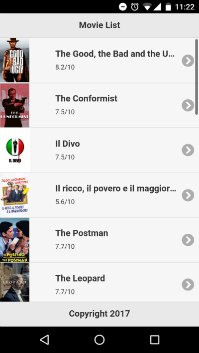

# Android Movie App

Native Mobile App with jQuery Mobile 1.5 and Cordova that displays a list of movies.

Based on this [tutorial]( http://www.gajotres.net/building-a-native-mobile-app-with-cordova-and-jquery-mobile/2/).

## Built with:

* Cordova
* jQuery Mobile

## Getting Started

1. Install [npm](npm.org) and install:

```bash
npm install -g grunt cordova jquery-mobile
```

2. Install java jdk and test installation with:

```bash
javac -version
```

3. Make sure your system PATH variable contains both npm and jdk\bin location

4. install Android studio and SDK and verify with

```bash
 adb
 ```

## Testing

With Android emulator:

```bash
cordova emulate android
```

Or if you connect your smartphone to your computer:

```bash
cordova run android
```

## Debug APK

A debug APK was left here: `CordovaMovieApp/platforms/android/build/outputs/apk/android-debug.apk`

## Preview


